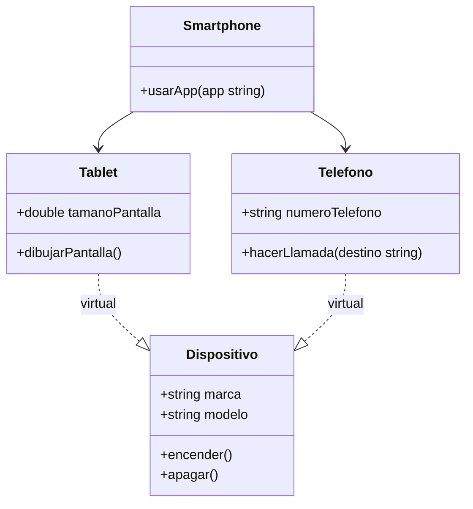

# Diagrama UML de la herencia virtual de clases



# El codigo es:

```cpp
#include <iostream>
using namespace std;

class Dispositivo {
public:
    string marca;
    string modelo;

    Dispositivo() {}

    Dispositivo(const string& marca, const string& modelo)
        : marca(marca), modelo(modelo) {}

    void encender() {
        cout << "Encendiendo dispositivo " << marca << " " << modelo << endl;
    }

    void apagar() {
        cout << "Apagando dispositivo " << marca << " " << modelo << endl;
    }
};

// Herencia virtual para evitar duplicación
class Tablet : virtual public Dispositivo {
public:
    double tamanoPantalla;

    Tablet() {}

    Tablet(double tamano) : tamanoPantalla(tamano) {}

    void dibujarPantalla() {
        cout << "Mostrando interfaz táctil en una pantalla de "
             << tamanoPantalla << " pulgadas" << endl;
    }
};

class Telefono : virtual public Dispositivo {
public:
    string numeroTelefono;

    Telefono() {}

    Telefono(const string& numero) : numeroTelefono(numero) {}

    void hacerLlamada(const string& destino) {
        cout << "Llamando desde " << numeroTelefono << " a " << destino << endl;
    }
};

class Smartphone : public Tablet, public Telefono {
public:
    Smartphone(const string& marca, const string& modelo,
               double tamanoPantalla, const string& numero)
        : Dispositivo(marca, modelo),
          Tablet(tamanoPantalla),
          Telefono(numero) {}

    void usarApp(const string& app) {
        cout << "Abriendo la app: " << app << " en " << marca << " " << modelo << endl;
    }
};

int main() {
    Smartphone s("Samsung", "X200", 6.5, "+123456789");
    s.encender();
    s.dibujarPantalla();
    s.hacerLlamada("+987654321");
    s.usarApp("WhatsApp");
    s.apagar();
    return 0;
}

}
```

# Salida del código
```
Encendiendo dispositivo Samsung X200
Mostrando interfaz táctil en una pantalla de 6.5 pulgadas
Llamando desde +123456789 a +987654321
Abriendo la app: WhatsApp en Samsung X200
Apagando dispositivo Samsung X200
```

