# El diagrama es:

```mermaid
classDiagram
    %% Definición de clases
    class Dispositivo {
        +marca: string
        +Dispositivo(marca: string)
        +encender(): void
        +apagar(): void
        +mostrarInformacion(): void
    }

    class TV {
        +pulgadas: int
        +tipoPantalla: string
        +volumen: int
        +TV(marca: string, pulgadas: int, tipoPantalla: string, volumen: int)
        +encender(): void
        +apagar(): void
        +mostrarInformacion(): void
    }

    class DVD {
        +tipoDisco: string
        +reproduciendo: bool
        +DVD(marca: string, tipoDisco: string, reproduciendo: bool)
        +encender(): void
        +apagar(): void
        +mostrarInformacion(): void
    }

    class ControlRemoto {
        +modelo: string
        +tieneBateria: bool
        +nivelBateria: int
        +dispositivoActual: Dispositivo*
        +ControlRemoto(modelo: string, bateria: bool, nivelBateria: int, dispositivo: Dispositivo*)
        +mostrarInformacion(): void
    }

    %% Relaciones
    Dispositivo <|-- TV
    Dispositivo <|-- DVD
    ControlRemoto --> Dispositivo : usa 
```



# El codigo es:

```cpp
#include <iostream>
using namespace std;

class Dispositivo {
    public:
    string marca;
    Dispositivo (const string marca) : marca(marca){}

    virtual void encender(){
        cout << "Se encendio el dispositivo" <<endl;
    }
    virtual void apagar(){
        cout << "Apagando el dispositivo" <<endl;
    }

    virtual void mostrarInformacion(){
        cout << "Dispositivo marca: " << marca <<endl;
    }
};

class TV : public Dispositivo{
    public:
    int pulgadas;
    string tipoPantalla;
    int volumen;

    TV(const string marca, const int pulgadas, const string tipoPantalla, const int volumen) : Dispositivo(marca), pulgadas(pulgadas), tipoPantalla(tipoPantalla), volumen(volumen) {}

    virtual void encender() override{
        cout << "Encendiendo la TV" <<endl;
    }
    virtual void apagar() override{
        cout << "Apagando la TV " <<endl;
    }

    virtual void mostrarInformacion() override{
        cout << "------------------------------------------TV------------------------------------------" <<endl <<
        "Dispositivo marca: " << marca <<endl << "Pulgadas: " <<pulgadas <<endl <<
        "Tipo de Pantalla: " << tipoPantalla <<endl 
        << "Volumen: " << volumen <<endl;
    }

};

class DVD : public Dispositivo{
    public:
    string tipoDisco;
    bool reproduciendo;

    DVD(const string marca, const string tipoDisco, const bool reproduciendo) : Dispositivo(marca), tipoDisco(tipoDisco), reproduciendo(reproduciendo) {}

    virtual void encender() override{
        cout << "Encendiendo el DVD" <<endl;
    }
    virtual void apagar() override{
        cout << "Apagando el DVD" <<endl;
    }

    virtual void mostrarInformacion() override{
        cout << "------------------------------------------DVD------------------------------------------" <<endl <<
        "Dispositivo marca: " << marca <<endl << "Tipo de Disco: " <<tipoDisco <<endl <<
        "Se esta reproduciendo: " << reproduciendo <<endl;
    }

};

class ControlRemoto{
    public:
    string modelo;
    bool tieneBateria;
    int nivelBateria;
    Dispositivo* dispositivoActual;

    ControlRemoto(const string modelo, const bool bateria, const int nivelBateria, Dispositivo* dispositivo) : modelo(modelo), tieneBateria(bateria), nivelBateria(nivelBateria), dispositivoActual(dispositivo) {}

    void mostrarInformacion() {
        cout << "------------------------------------------Control Remoto------------------------------------------" <<endl <<
        "Modelo: " << modelo <<endl << "Tiene bateria: " <<tieneBateria <<endl <<
        "Nivel de bateria: " << nivelBateria <<endl<<
        "Informacion del dispositivo: " << endl;
        dispositivoActual->mostrarInformacion() ;
    }
};


int main(){
    Dispositivo* dispositivo1 = new Dispositivo("Samsung");
    TV* tv = new TV("Samsung", 25, "LED", 78);
    DVD* dvd = new DVD("LG", "SSD", true);

    dispositivo1->encender();
    dispositivo1->apagar();
    dispositivo1->mostrarInformacion();

    tv->encender();
    tv->apagar();
    tv->mostrarInformacion();

    dvd->encender();
    dvd->apagar();
    dvd->mostrarInformacion();

    ControlRemoto control1("Apple", true, 88, dispositivo1);
    control1.mostrarInformacion();
 
    return 0;
}
```