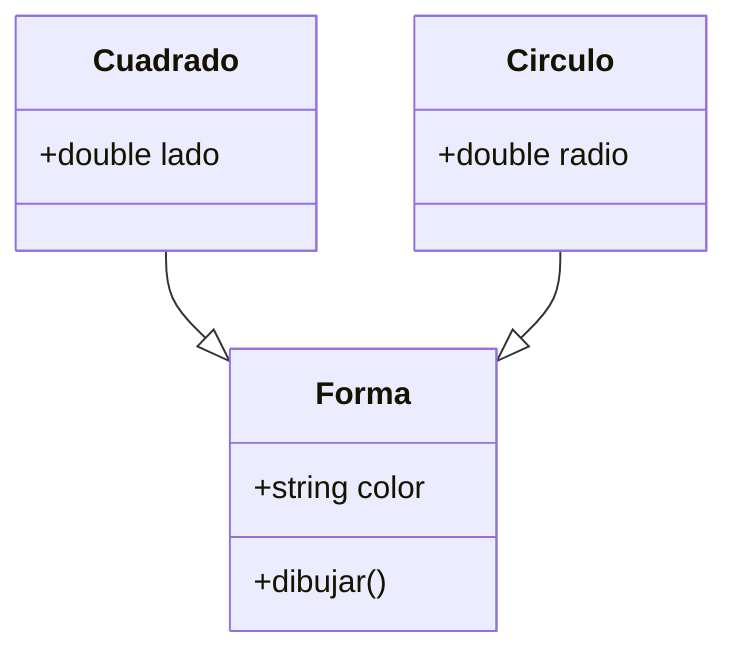

# Diagrama de clases:



# Codigo c++ del diagrama:
```cpp
#include <iostream>
using namespace std;

class Forma {
public:
    string color;
    virtual void dibujar() {
        cout << "Dibujando" <<endl;
    }
};

class Cuadrado : public Forma {
public:
    double lado;
};

class Circulo : public Forma {
public:
    double radio;
};

int main(){
    Cuadrado cuadrado;
    cuadrado.dibujar();
}
```

## Salida
```
Dibujando
```